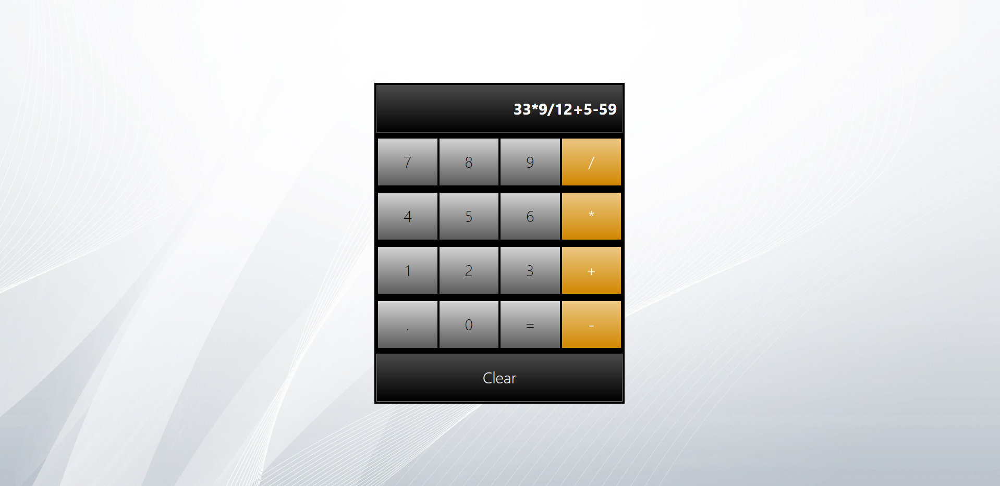
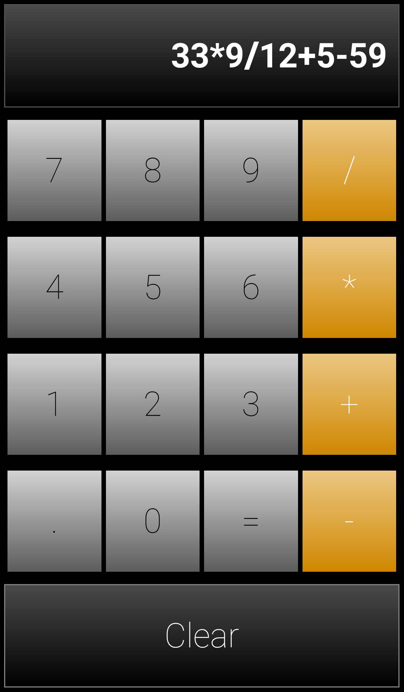

<!-- PROJECT HEADER -->
<br />
<p align='center'>
  <h3 align='center' style='font-size: 32px'>Calculator App</h3>
  <p align='center'>
    Simple calculator build in Reaxt.js
    <br />
    <br />
    <a href='https://skkarolinav.github.io/calculator-app/' style='font-size: 20px'>View Live Demo</a>
  </p>
</p>

# 
<!-- TABLE OF CONTENTS -->
## Table of Contents

* [About the Project](#about-the-project)
  * [Built With](#built-with)
* [Getting Started](#getting-started)
* [License](#license)
* [Contact](#contact)

#
<!-- ABOUT THE PROJECT -->
## About The Project

<div align='center'>
  PC display
  
  <br />
  Mobile display
  <br />
  
</div>

The project was created using React.js.
In this application we can use four simple mathematical operations:

* division
* multiplication
* addition
* subtraction

### Built With
To create this application I used:
* [React.js](https://reactjs.org)
* [Bootstrap](https://getbootstrap.com) 
* [Mathjs](https://mathjs.org/)

#
<!-- GETTING STARTED -->
## Getting Started

To run this application one should install math library math.js
```
npm install mathjs
```
#
<!-- LICENSE -->
## License
Distributed under the MIT Licence.

#
<!-- CONTACT -->
## Contact

Name and Surname: <span style='color: green'> Karolina Banasiewicz </span>

E-mail: skkarolinav@gmail.com

GitHub: [Link](https://github.com/Skkarolinav)

LinkedIn: [Link](https://www.linkedin.com/in/karolina-banasiewicz-661a00188/)
